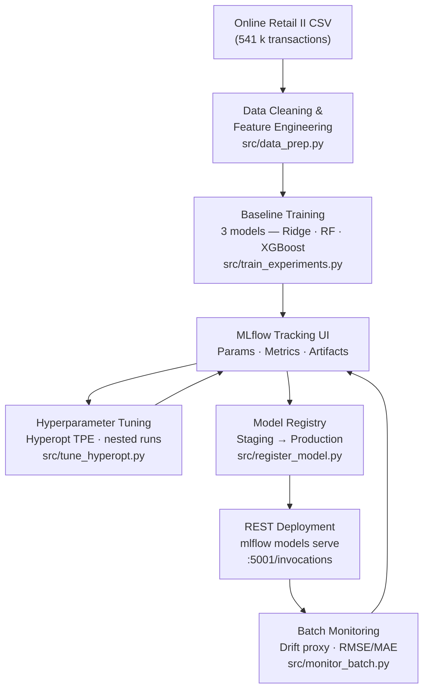

# Retail Unit Price Prediction — MLflow Lifecycle Project

**AIN-3009 MLOps · Bahçeşehir University**

A complete, end-to-end demonstration of the MLflow machine-learning lifecycle applied to a real-world retail dataset. The project predicts the **unit price** of products sold by a UK-based online retailer, and walks through every stage of production ML: experiment tracking, hyperparameter tuning, model registry, REST deployment, and post-deployment monitoring.

---

## ML Lifecycle Architecture



---

## Repository Structure

```
retail-price-mlflow/
├── MLops Project.py          # Root-level entry point (aliases src/train_experiments.py)
├── requirements.txt          # Pinned dependencies
├── RUNBOOK.txt               # Quick-reference command cheatsheet
├── README.md                 # This file
│
├── data/
│   └── online_retail_II.csv  # UCI Online Retail II dataset (place here before running)
│
├── mlflow_data/              # Auto-created — SQLite tracking DB + artifact store
│   ├── tracking.db
│   └── artifacts/
│
└── src/
    ├── config.py             # All paths and experiment/model names in one place
    ├── data_prep.py          # Load → clean → engineer features → train/val split
    ├── train_experiments.py  # Train Ridge / Random Forest / XGBoost; log to MLflow
    ├── tune_hyperopt.py      # Hyperopt TPE search with nested MLflow runs
    ├── register_model.py     # Pick best run → register in Model Registry → set stage
    ├── predict_example.py    # Load any logged model and print sample predictions
    └── monitor_batch.py      # Simulate batch inference; log drift metrics to MLflow
```

---

## Dataset

**Online Retail II** — UCI Machine Learning Repository  
<https://archive.ics.uci.edu/dataset/502/online+retail+ii>

| Property | Value |
|---|---|
| Records | ~541 000 transactions |
| Period | 01 Dec 2009 – 09 Dec 2011 |
| Domain | UK-based non-store online retail |
| Target | `Price` — unit price per item (GBP) |
| Key features | `StockCode`, `Description`, `Quantity`, `Country`, `InvoiceDate` |

The target is log-transformed (`log1p(Price)`) during training; all evaluation metrics are reported in log-space.

---

## Setup

### Prerequisites

- Python 3.10, 3.11, or 3.12 (3.13+ not yet supported by all wheels)
- macOS / Linux / WSL2

### 1 — Create a virtual environment

```bash
python3.12 -m venv .venv
source .venv/bin/activate        # Windows: .venv\Scripts\activate
pip install --upgrade pip
pip install -r requirements.txt
```

### 2 — Place the dataset

Download `online_retail_II.csv` from the UCI link above and copy it to:

```
retail-price-mlflow/data/online_retail_II.csv
```

> **macOS XGBoost note:** if `import xgboost` fails with a `libomp` error, run `brew install libomp`. The code falls back to `HistGradientBoostingRegressor` automatically if XGBoost is unavailable.

---

## Step-by-Step Run Guide

All commands assume you are in the **project root** with the virtualenv activated.

### Step 1 — Train baseline models (experiment tracking)

```bash
cd src
RETAIL_SAMPLE_FRAC=0.25 ../.venv/bin/python train_experiments.py
```

This trains **Ridge regression**, **Random Forest**, and **XGBoost** (or HistGBRT) and logs every run — parameters, RMSE/MAE/R², and the serialised model artifact — to the local MLflow SQLite store.

Set `RETAIL_SAMPLE_FRAC=1` or omit it to train on the full dataset (slower, needs ~4 GB RAM).

### Step 2 — Inspect runs in the MLflow UI

```bash
# From the project root:
.venv/bin/mlflow ui --backend-store-uri sqlite:///$(pwd)/mlflow_data/tracking.db
```

Open <http://127.0.0.1:5000> in your browser. Compare RMSE, MAE, and R² across runs, drill into parameters, and download model artifacts.

### Step 3 — Hyperparameter tuning

```bash
cd src
HYPEROPT_MAX_EVALS=24 RETAIL_SAMPLE_FRAC=0.25 ../.venv/bin/python tune_hyperopt.py
```

Runs **Hyperopt TPE** search (or a manual random parameter sampler if Hyperopt is unavailable) over XGBoost/HistGBRT hyperparameters. Every trial is logged as a **nested child run** under a single parent run, visible in the MLflow UI.

Increase `HYPEROPT_MAX_EVALS` for a more thorough search (24–50 is a good range).

### Step 4 — Register the best model

```bash
cd src
# Register (picks lowest-RMSE run from the baseline experiment):
../.venv/bin/python register_model.py

# Register and immediately move to Staging:
../.venv/bin/python register_model.py --stage Staging

# Promote to Production:
../.venv/bin/python register_model.py --stage Production

# Register from the tuning experiment instead:
../.venv/bin/python register_model.py --experiment retail_unit_price_hyperopt
```

The model appears in the **MLflow Model Registry** under the name `retail_price_regressor`.

### Step 5 — Serve the model as a local REST API

```bash
# Copy a run_id from the MLflow UI, then:
.venv/bin/mlflow models serve \
    -m runs:/<RUN_ID>/model \
    -h 127.0.0.1 -p 5001 \
    --no-conda
```

Test with `curl`:

```bash
curl -s -X POST \
  -H "Content-Type: application/json" \
  --data '{
    "dataframe_split": {
      "columns": ["Quantity","desc_len","desc_word_count","month","dow","hour","Country","stock_prefix"],
      "data": [[6, 22, 4, 12, 4, 8, "United Kingdom", "850"]]
    }
  }' \
  http://127.0.0.1:5001/invocations
```

Or use `predict_example.py` for a scripted demo:

```bash
cd src
../.venv/bin/python predict_example.py --model-uri runs:/<RUN_ID>/model --rows 10
```

### Step 6 — Run batch monitoring

```bash
cd src
../.venv/bin/python monitor_batch.py

# Or target a specific registered version:
../.venv/bin/python monitor_batch.py --model-uri models:/retail_price_regressor/Production
```

Scores a held-out 8 % batch of the dataset and logs `monitoring_rmse`, `monitoring_mae`, `monitoring_mean_abs_residual`, and a **prediction-std drift proxy** to the `retail_price_monitoring` MLflow experiment. Run this repeatedly (or schedule it) to track metric drift over time in the UI.

---

## Models Compared

| Model | Notes |
|---|---|
| Ridge (linear) | Baseline; fast, interpretable |
| Random Forest | 120 trees, unlimited depth |
| XGBoost | 200 rounds, depth 8, lr 0.08 (preferred) |
| HistGBRT | sklearn fallback when XGBoost unavailable |

All models are wrapped in a **scikit-learn `Pipeline`** (imputation → scaling/OHE → estimator), ensuring identical preprocessing for training, inference, and serving.

---

## Expected Results

On a 25 % sample of the data (≈135 k rows after cleaning), typical validation metrics:

| Model | RMSE (log-space) | MAE (log-space) | R² |
|---|---|---|---|
| Ridge | ~0.55 | ~0.38 | ~0.22 |
| Random Forest | ~0.38 | ~0.26 | ~0.60 |
| XGBoost | ~0.33 | ~0.22 | ~0.68 |

After Hyperopt tuning, XGBoost RMSE typically drops a further 3–8 % depending on `max_evals`.

---

## Tech Stack

| Component | Library / Tool |
|---|---|
| ML lifecycle | MLflow ≥ 2.14 |
| Models | scikit-learn ≥ 1.3, XGBoost ≥ 2.0 |
| Hyperparameter search | Hyperopt ≥ 0.2.7 |
| Data | pandas ≥ 2.0, numpy ≥ 1.24 |
| Backend store | SQLite (no separate server needed) |
| Language | Python 3.10 – 3.12 |
